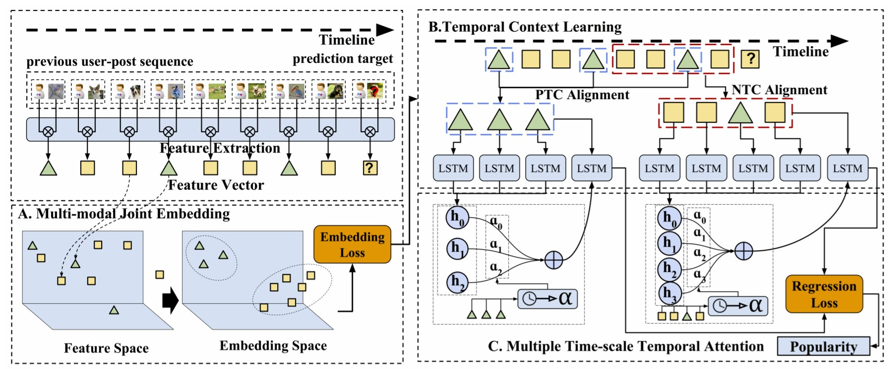

# DTCN
This is the implementation of our paper "[Sequential Prediction of Social Media Popularity with Deep Temporal Context Networks](https://www.ijcai.org/Proceedings/2017/427)".

# Dataset

To successfully test performance, we created [TPIC dataset](https://github.com/social-media-prediction/TPIC2017), a temporal popularity image collection dataset. 

# Model

Our DTCN contains three main components, from embedding, learning to predicting. With a joint embedding network, we obtain a unified deep representation of multi-modal user-post data in a common embedding space. Then, based on the embedded data sequence over time, temporal context learning attempts to recurrently learn two adaptive temporal contexts for sequential popularity. Finally, a novel temporal attention is designed to predict new popularity (the popularity of a new user-post pair) with temporal coherence across multiple time-scales.



# Code

The code is pure python. Keras is chosen to be the deep learning library here. Environment is configured by Anaconda. The environment file is saved as "environment.yml".

## Environment

- Ubuntu 16.04
- Python 2.7
- Cuda 10.0
- cudnn 7.6.5

## Setup
```bash
conda env create -f environment.yml
```

## Prequisition

- Clone the repository to your local machine
- Acquire relevant dataset
- Extract the image feature with ResNet (2048 dims)
- Run script by seeing example.

## Usage

```bash
DATA_HOME=test_data/TRIM_DATA
KERAS_BACKEND=theano \
THEANO_FLAGS='mode=FAST_RUN,device=cuda0,nvcc.fastmath=True,optimizer=fast_run' \
python main.py \
-feature_path $DATA_HOME/USER_20W_SORTED_BY_TIME.txt \
-meta_path $DATA_HOME/ResNet_20W_2048_SORTED_BY_TIME.txt \
-label_path $DATA_HOME/LABEL_20W_SORTED_BY_TIME.txt \
-algorithm SHARED_DTCN \
-nb_epoch 1000 \
-start_cross_validation 2 \
-total_cross_validation 3 \
-identifier_path $DATA_HOME/USERID_20W_SORTED_BY_TIME.txt \
-timestamps_path $DATA_HOME/TIMESTAMP_20W_SORTED_BY_TIME.txt \
-visual_mlp_enabled y \
-timestep 10 \
-time_align y \
-time_dis_con continue \
-time_context_length 18 \
-time_unit_metric hour \
-discrete_time_start_offset 2 \
-discrete_time_unit 4 \
-train_set_partial 9 \
-merge_mode concat \
-dual_time_align n \
-time_weight_mode time_flag \
-dual_lstm n
```

# Result

# Citation

```Bibtex
@inproceedings{Wu2017DTCN,
  title={Sequential Prediction of Social Media Popularity with Deep Temporal Context Networks},
  author={Wu, Bo and Cheng, Wen-Huang and Zhang, Yongdong and Qiushi, Huang and Jintao, Li and Mei, Tao},
  booktitle={IJCAI},
  year={2017},
  location = {Melbourne, Australia}}
```

Please concat us (social.media.prediction@gmail.com) if you have further questions or cooporations
